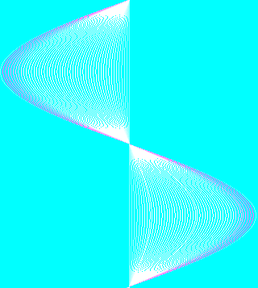

# Part 3, Scene 6 — the wave particles

`Demo_Scene6` at `120f:04d0`. Reconstruction: [`src/P3WAVES.PAS`](../src/P3WAVES.PAS).

## What it is

800 particles tracing precomputed curves, swept across the screen four times
with different parameters each pass.

Curve shapes are not computed at run time. A 36,414-byte table holds **51
curves of 357 X-offsets each**; a particle is just `(curve index, phase, row)`,
and advancing its phase walks it along its curve.

## Assets

| File | Size | Role |
|---|---:|---|
| [`WAVECURV.BIN`](../assets/part003/WAVECURV.BIN) | 36,414 | 51 × 357 signed 16-bit X offsets |

51 × 714 = 36,414 exactly, which is what fixes the stride (`$2CA` = 714 bytes
per curve, as used in the indexing).

## The particle record

Four bytes, straight from the DGROUP layout:

```
+0  curve index
+1  phase (word)
+3  screen row
```

## Erase-then-draw

There is no screen clear. Each particle erases its own previous pixel and draws
the new one:

```pascal
OldX := Curve[C, Phase] + SweepX - 1;
Phase := Phase mod 356 + 1;
NewX := Curve[C, Phase] + SweepX;
Mem[$A000 : YOfs[Row] + OldX] := 0;
Mem[$A000 : YOfs[Row] + NewX] := Phase shr 1;
```

With 800 particles that is 1,600 byte writes per frame against 64,000 for a
full clear. Colour is `Phase div 2`, so a particle's colour shifts as it
travels and the motion reads as a gradient.

This scene writes straight to `$A000` with no virtual screen — consistent with
never needing a full-screen operation.

**The scene builds its own palette, inside `Waves_LoadCurves` (`120f:0017`).** After the curve `BlockRead` the routine lays a blue TRIANGLE ramp over exactly the colours `Step` draws with (`Phase shr 1` = 0..178), on the x87 with the ten-byte extended 0.4 at `CS:$000D`: `SetPalette(I,0,0, Round(I*0.4)+27)` for 1..89 rising to the DAC's 63, then `Round((178-I)*0.4)+27` for 89..178 falling back — so a particle is brightest MID-PHASE and dim at both ends of its curve. **This was the real cause of the plan investigation `part3-s6-left-dark`**: the reconstruction had ended `LoadCurves` at the `Close`, inheriting the previous scene's monotone ramp, under which the low phases (the shape's left half) rendered dark — measured off the comparison screenshots as median blue 84 left vs 108 right, against the original's uniform ~107. Confirmed fixed against ORIG3 by the author. The routine also shows the unit was compiled `{$I-}` (no IOCheck after any I/O call) and holds `F` as a DGROUP global at `DS:$D20C`.

**The erase/draw is hand BASM (`120f:01b1`), and the Pascal above is what it MEANS, not what it DOES.** `ES` and the row offset in `CX` are set up inside the erase branch only, so a particle whose old pixel is offscreen and whose new pixel is not gets its draw stored through the registers the compiled code happens to leave: `ES` = the curve table's segment (from the `LES` that read the curve) and `CX` = 356 (the phase-update `IDIV`'s divisor). The stray store lands in the curve table at offset `356 + NewX` — bytes 357..675, the back half of curve 0, the straight centre line — corrupting it slowly over the four passes. This is the original's own bug, kept transcribed verbatim (fragment target `@asm 003 120f:01b1 +59`); an earlier revision of this page blamed it for the left-half brightness difference, and that attribution was wrong — the palette above is the cause. The unit needs `{$G+}`: with 8086 codegen the compiler multiplies with `MUL DX` and parks the phase×2 temp in `CX`, destroying the 356 the bug writes through. All 249 bytes of `Waves_Step` match the binary modulo DGROUP displacements.

**A correction that fell out of the byte comparison**: `NEUROSIS_003_fpu.exe` differs from `NEUROSIS_003.exe` exactly by TP7's `CD 3x` emulator traps rewritten to raw `9B`+ESC — because the `_fpu` files are THIS PROJECT'S disassembly aids (see `docs/02-fpu-emulator.md`), not 1994 variants. The real release carries the traps, as our builds do; the RTL patches them to raw FPU opcodes at startup when an x87 is present.

## Four passes

Each pass reseeds the array, spreads the phases so particles are staggered
along their curves, then sweeps `SweepX` from −320 to +320 (640 frames, roughly
9 seconds at 70 Hz — about 36 seconds for the scene).

| Pass | Curve index | Row |
|---|---|---|
| 1 | 30 (all particles on one curve) | `I mod 200` |
| 2 | `(I mod 100) div 2` | `(I*4) mod 200` |
| 3 | `(I mod 100) div 2` | `(I*8) mod 200` |
| 4 | `(I mod 200) div 4` | `(I*8) mod 200` |

The phase spread is done the slow way — a loop advancing one particle's phase
`(i*15) mod 360` times, one step at a time. That is a couple of hundred
thousand iterations, but it only runs four times, between passes.

## Resolved — what the 51 curves look like

They are **absolute X coordinates, not signed offsets** — every value lies in
0..317 and every curve starts at x = 160, the centre of the screen. (An earlier
version of this page called them offsets; that was wrong.)

The 51 curves are **one shape at 51 amplitudes**. Each traces a decaying
oscillation away from centre — out to one side, back, out to the other — and the
peak-to-peak amplitude grows strictly monotonically with the index:

| Curve | Amplitude |
|---:|---:|
| 0 | 0 — a dead straight vertical line |
| 1 | 6 |
| 15 | 95 |
| 30 | 190 |
| 50 | 317 — the full width of the screen |

So the curve index is effectively an **amplitude dial**, which is exactly why
the passes work as they do: pass 0 puts every particle on curve 30 so they all
trace the same mid-amplitude wave, and the later passes spread the indices to
fan the particles into a family of nested waves.



*All 51 overlaid — [`WAVECRVA.PNG`](../assets/part003/WAVECRVA.PNG).*

## Open

- Nothing outstanding.
